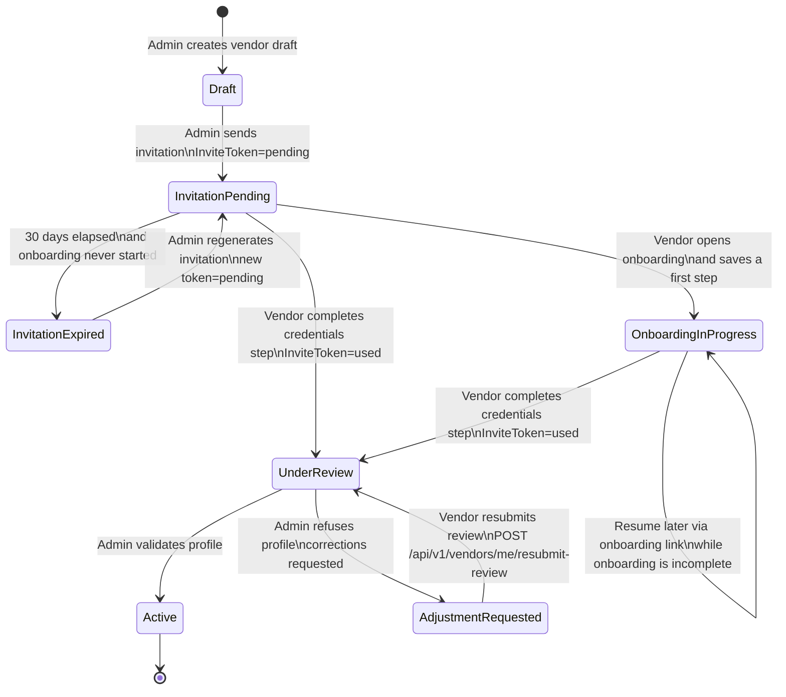
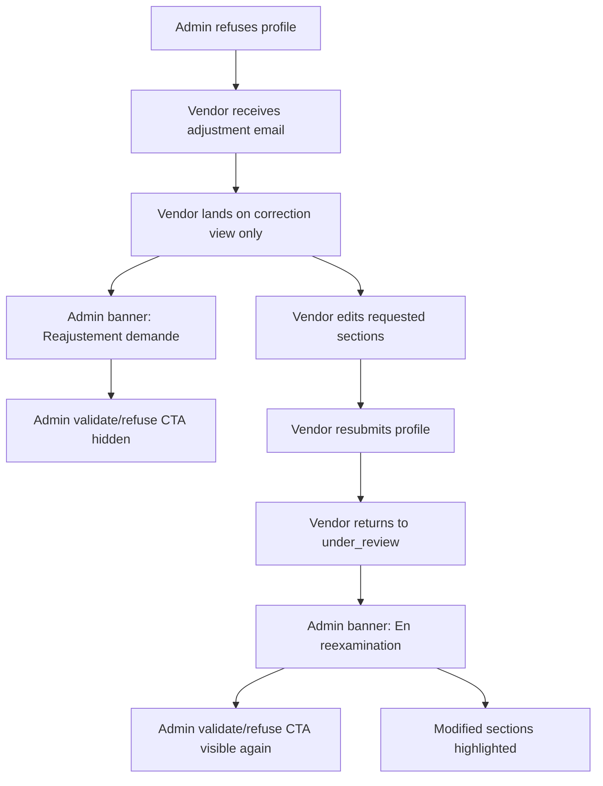

# Vendor Lifecycle Flow Reference

## Scope

Référence visuelle issue de WED-22 et WED-47 pour le cycle prestataire
complet :

- invitation admin
- onboarding prestataire
- validation admin
- refus et resoumission
- miroir admin ↔ prestataire

Cette note documente le **flux cible** validé côté produit. Quand le code ou
les règles existantes ne sont pas encore alignés, l'écart est listé dans la
section `Gaps`.

Sources consolidées :

- WED-22 description + fil de commentaires
- WED-47 description
- `docs/memory-vault/rules/invite-tokens.md`
- `docs/memory-vault/rules/admin-vendor-lifecycle.md`
- `docs/memory-vault/rules/vendor-onboarding.md`
- `apps/api/src/Enum/User/InviteTokenStatus.php`
- `apps/api/src/Enum/Vendor/VendorStatus.php`
- `apps/api/src/Enum/User/UserStatus.php`
- `apps/api/src/Enum/Vendor/OnboardingStep.php`

## Global flow

## Refusal and resubmission zoom

## Mirror table

| Phase | Invite token | Vendor | User | `onboarding_step` | Admin view | Prestataire view |
|---|---|---|---|---|---|---|
| Draft before invitation | none | `pending` | `pending` | `null` | `Brouillons` | Aucun acces |
| Invitation sent, never opened | `pending` | `pending` | `pending` | `null` | `Onboarding en cours` | Lien onboarding valide |
| Onboarding started, not completed | `pending` | `pending` | `pending` | last completed step | `Onboarding en cours` | Reprise du stepper via lien |
| Invitation expired before first access | `expired` | `pending` | `pending` | `null` | CTA de regeneration | Lien invalide |
| Onboarding fully completed | `used` | `under_review` | `under_review` | `credentials` | `En attente de validation` | Ecran `Profil en attente de validation` |
| Profile validated | `used` | `active` | `active` | `credentials` | `Valides` | Dashboard complet |
| Corrections requested after refusal | target: `used` and no onboarding link reuse | target: `suspended` | `suspended` | `credentials` | Bandeau `Reajustement demande`, CTA masques | Vue correction, pas le dashboard |
| Resubmitted after corrections | target: `used` | `under_review` | `under_review` or `suspended` to clarify | `credentials` | Bandeau `En reexamination`, CTA visibles, pastilles sur sections modifiees | Ecran post-resoumission sans CTA |

## Coverage vs implementation tickets

| Ticket lot | Scope covered by the flow |
|---|---|
| Ticket 1 | Semantics of token expiry, token `used`, `onboarding_step` resume rules, status model clarification required for refusal/resubmission |
| Ticket 2 | Admin wording and mutual exclusivity between `Onboarding en cours` and `En attente de validation` |
| Ticket 3 | Regeneration path for an expired invitation |
| Ticket 4 | Prestataire blocked screen while `under_review` |
| Ticket 5 | Refusal email, correction view, resubmission endpoint, admin banners and section markers |

## Gaps

### Coverage conclusion

Le decoupage 1 a 5 couvre bien le scope produit **a condition** de clarifier le
modele d'etat exact du cycle refus/resoumission dans Ticket 1 ou 5a. Sans cette
clarification, la partie refus reste ambiguë.

### Documented discrepancies with the current codebase

1. `InviteTokenStatus` ne contient aujourd'hui que `pending`, `used` et
   `expired`. Il n'existe pas de statut `under_review` pour les tokens. Le flux
   cible doit donc traiter `under_review` comme un etat vendor/user, pas comme
   un enum de token, sauf evolution explicite ulterieure.
2. `VendorStatus` ne contient aujourd'hui pas `suspended`. Le code et la regle
   `ADMIN-VENDOR-004` utilisent encore `rejected` lors d'un refus admin.
3. `UserStatus` contient `suspended`, mais l'etat apres resoumission n'est pas
   encore tranche entre retour a `under_review` et maintien en `suspended`
   jusqu'a la revalidation admin.
4. `InviteTokenService::resolve()` expire tout token `pending` depasse, sans
   verifier si l'onboarding a deja commence. Cela contredit la decision produit
   `expiration uniquement si le prestataire n'a jamais accede a l'onboarding`.
5. Le frontend prestataire actuel affiche seulement un ecran bloque generique
   pour les statuts non `active`. La vue correction dediee et l'ecran
   `En reexamination` ne sont pas encore implementes.
6. Le wording admin actuel reste `Invitations en attente` et `En attente`.
   Le renommage cible `Onboarding en cours` / `En attente de validation` n'est
   pas encore applique.

### Open points that remain product/implementation decisions

- Le statut exact du `vendor` pendant le reajustement :
  `rejected` dans le code actuel, `suspended` dans la cible WED-22/WED-47.
- Le statut exact du `user` apres resoumission :
  retour a `under_review` ou maintien `suspended` jusqu'a validation finale.
- Le support visuel des pastilles de sections modifiees cote prestataire, pas
  seulement cote admin.
