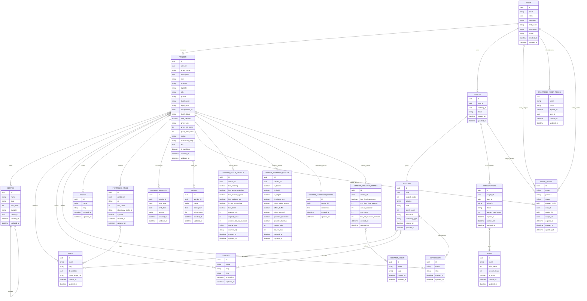

# Wedly Schema Preview

Open this file in Zed and use the Markdown preview.

```mermaid
erDiagram
    USER ||--o| VENDOR : manages
    USER ||--o| COUPLE : owns
    COUPLE ||--|| WEDDING : plans

    VENDOR }o--o{ SERVICE : offers
    VENDOR }o--o{ "STYLE" : masters
    VENDOR }o--o{ CULTURE : knows
    VENDOR }o--o{ CONFESSION : serves
    VENDOR }o--o{ REGION : covers

    WEDDING }o--o{ "STYLE" : aesthetic
    WEDDING }o--o{ CULTURE : cultures
    WEDDING }o--o{ CONFESSION : confessions

    PORTFOLIO_IMAGE }o--o{ "STYLE" : tags
    VENDOR ||--o{ PORTFOLIO_IMAGE : portfolio
    VENDOR ||--o{ BOOKING_BLOCKER : unavailable
    VENDOR ||--o{ OFFER : offers_list

    COUPLE ||--o{ SUBSCRIPTION : subscriptions
    SUBSCRIPTION }o--|| PLAN : plan

    USER ||--o{ INVITE_TOKEN : invite_subject
    USER ||--o{ PASSWORD_RESET_TOKEN : reset_tokens
    USER ||--o{ INVITE_TOKEN : invite_creator
    VENDOR ||--o{ INVITE_TOKEN : vendor_invites
    COUPLE ||--o{ INVITE_TOKEN : couple_invites

    VENDOR ||--o| VENDOR_VENUE_DETAILS : venue_details
    VENDOR ||--o| VENDOR_CATERING_DETAILS : catering_details
    VENDOR ||--o| VENDOR_ANIMATION_DETAILS : animation_details
    VENDOR ||--o| VENDOR_CREATOR_DETAILS : creator_details
    VENDOR_CREATOR_DETAILS }o--o{ CREATOR_VALUE : values

    SERVICE ||--o{ SERVICE : children

    USER {
        uuid id
        string email
        json roles
        string password
        string first_name
        string last_name
        string status
        datetime created_at
        datetime updated_at
    }

    VENDOR {
        uuid id
        uuid user_id
        string brand_name
        text description
        string siret
        string address
        string zipcode
        string city
        string phone
        string legal_name
        string legal_form
        date incorporated_at
        string legal_status
        boolean siret_verified
        string price_type
        int price_min_cents
        int price_max_cents
        string status
        string onboarding_step
        text bio
        boolean is_published
        datetime created_at
        datetime updated_at
    }

    COUPLE {
        uuid id
        uuid user_id
        uuid wedding_id
        string status
        datetime created_at
        datetime updated_at
    }

    WEDDING {
        uuid id
        date date
        int budget_cents
        string location
        string zone
        int guest_count
        string ambiance
        string ceremony_type
        datetime created_at
        datetime updated_at
    }

    "STYLE" {
        uuid id
        string name
        string slug
        text description
        string cover_image_url
        datetime created_at
        datetime updated_at
    }

    CULTURE {
        uuid id
        string name
        string slug
        string type
        datetime created_at
        datetime updated_at
    }

    CONFESSION {
        uuid id
        string name
        string slug
        datetime created_at
        datetime updated_at
    }

    REGION {
        uuid id
        string name
        string slug
        datetime created_at
        datetime updated_at
    }

    SERVICE {
        uuid id
        string name
        string slug
        int sort_order
        string category
        uuid parent_id
        datetime created_at
        datetime updated_at
    }

    OFFER {
        uuid id
        uuid vendor_id
        string name
        text description
        int price_cents
        datetime created_at
        datetime updated_at
    }

    PORTFOLIO_IMAGE {
        uuid id
        uuid vendor_id
        string url
        int sort_order
        string cloudinary_public_id
        boolean is_cover
        datetime created_at
        datetime updated_at
    }

    BOOKING_BLOCKER {
        uuid id
        uuid vendor_id
        date start_date
        date end_date
        string reason
        datetime created_at
        datetime updated_at
    }

    PLAN {
        uuid id
        string name
        int price_cents
        int service_count
        boolean is_active
        datetime created_at
        datetime updated_at
    }

    SUBSCRIPTION {
        uuid id
        uuid couple_id
        uuid plan_id
        string stripe_id
        string status
        int amount_paid_cents
        datetime expires_at
        datetime created_at
        datetime updated_at
    }

    INVITE_TOKEN {
        uuid id
        string token
        string persona
        string status
        uuid created_by_id
        uuid user_id
        uuid vendor_id
        uuid couple_id
        datetime expires_at
        datetime created_at
        datetime updated_at
    }

    PASSWORD_RESET_TOKEN {
        uuid id
        string token
        string status
        datetime expires_at
        uuid user_id
        datetime created_at
        datetime updated_at
    }

    VENDOR_VENUE_DETAILS {
        uuid id
        uuid vendor_id
        boolean has_catering
        boolean has_accommodation
        boolean has_outdoor_space
        boolean has_corkage_fee
        boolean is_pmr_accessible
        boolean has_toilets
        int capacity_min
        int capacity_max
        int distance_to_city_minutes
        string venue_type
        string nearest_city
        datetime created_at
        datetime updated_at
    }

    VENDOR_CATERING_DETAILS {
        uuid id
        uuid vendor_id
        boolean is_kosher
        boolean is_halal
        boolean is_vegan
        boolean is_gluten_free
        boolean offers_table_service
        boolean offers_buffet
        boolean offers_cocktail
        boolean provides_tableware
        boolean provides_furniture
        int covers_min
        int covers_max
        datetime created_at
        datetime updated_at
    }

    VENDOR_ANIMATION_DETAILS {
        uuid id
        uuid vendor_id
        text description
        datetime created_at
        datetime updated_at
    }

    VENDOR_CREATOR_DETAILS {
        uuid id
        uuid vendor_id
        boolean has_fixed_workshop
        int min_lead_time_months
        int annual_capacity
        int rdv_count
        int first_rdv_duration_minutes
        datetime created_at
        datetime updated_at
    }

    CREATOR_VALUE {
        uuid id
        string name
        string slug
        datetime created_at
        datetime updated_at
    }
```
